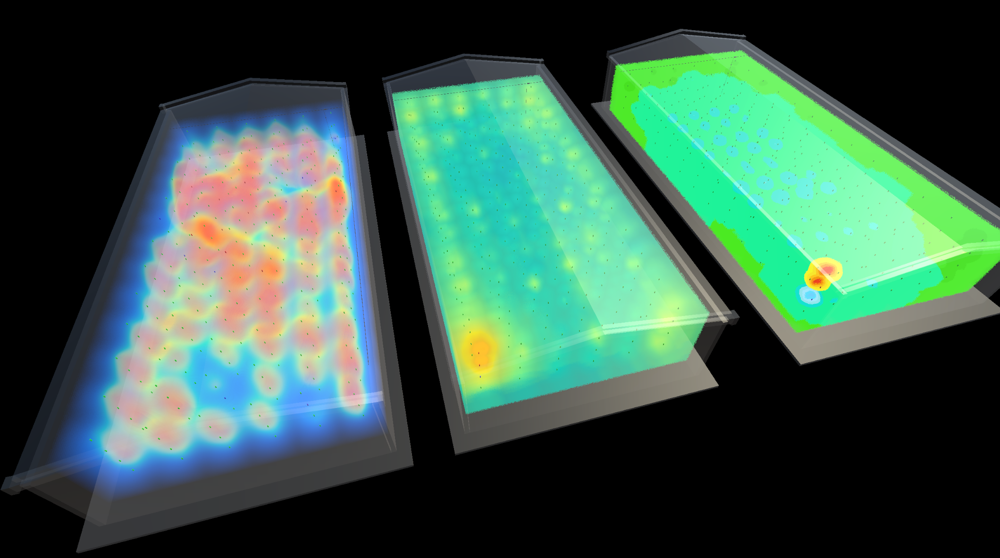

# HeatVolume-Unity: High-Performance Volumetric 3D Thermal Visualization

A high-performance **3D Heatmap Visualization** system developed in Unity 6, specifically designed for **Digital Twin** applications (such as intelligent grain storage). It transforms discrete sensor data into immersive, fluid-like thermal volumes using CPU parallel processing and custom Raymarching.

---

## 🚀 Key Features

* **Parallel IDW Computing Core**: Powered by the **C# Job System** (`IJobParallelFor`), distributing Inverse Distance Weighting (IDW) interpolation across all CPU cores. It is highly optimized for performance-sensitive environments like **WebGL**.
* **Voxel Rendering Pipeline**: Instead of traditional mesh-based interpolation, this system generates a dynamic `Texture3D` voxel grid, eliminating visual banding and artifacts.
* **Advanced Raymarching Shaders**:
    * **Dual Mode Rendering**: Supports both smooth organic "Rainbow" gradients and industry-standard 20-level precise discrete color banding.
    * **Fluid Turbulence**: Integrated 3D Simplex noise and time-based offsets to simulate the rising "heat haze" and atmospheric turbulence of high-temperature zones.
    * **Visual Fidelity**: Implements screen-space dithering to eliminate sampling layers and HDR glowing for critical hot spots.
* **Industrial Layout Support**:
    * **Square Granary**: Automatic matrix-based cubic grid generation.
    * **Circular Silo**: Parametric cylindrical distribution based on ring/radius settings.
* **Data Snapshot System**: Capability to capture and compare thermal states (e.g., "Before" vs "After" ventilation) for historical data analysis.

---

## 🛠 Technical Architecture

### 1. The Algorithm: Parallelized IDW
The system treats every voxel in the $Texture3D$ as an independent calculation unit. The Job System calculates the weighted temperature influence of all nearby sensors:
$$f(x) = \frac{\sum_{i=1}^{n} w_i(x) \cdot t_i}{\sum_{i=1}^{n} w_i(x)}$$
Where the weight is defined as $w_i(x) = \frac{1}{d(x, x_i)^2 + \epsilon}$.

### 2. Implementation Pipeline
1.  **Parsing**: Deserializes sensor coordinates and real-time temperatures from JSON data.
2.  **Mapping**: Spawns physical sensor proxies and aligns them within the normalized volume bounds.
3.  **Job Processing**: Fills a `NativeArray<Color32>` with interpolated thermal data.
4.  **Buffer Upload**: Updates the `Texture3D` GPU resource in a single frame.
5.  **Raymarching Pass**: The URP shader samples the texture and performs volumetric integration with custom color mapping.

---

## 📦 Getting Started

### Requirements
* **Unity Version**: Unity 6 (or 2023.3+)
* **Render Pipeline**: Universal Render Pipeline (URP)

### Installation & Usage
1.  Clone the repository and open the project in Unity.
2.  Attach the `HeatVolumeManager_CPU.cs` script to an empty GameObject.
3.  Assign a material using either `HeatRaymarching.shader` or `HeatRaymarching_Gradient.shader`.
4.  Load your JSON sensor data into the `Real Data Text File` slot.

---

## 🎨 Visual Tuning

| Parameter | Function |
| :--- | :--- |
| **Step Size** | Controls sampling density. Lower values improve quality at the cost of performance. |
| **Noise Scale** | Adjusts the granularity of the thermal fluid pattern. |
| **Glow Intensity** | Adjusts the HDR brightness for areas exceeding defined high-temperature thresholds. |
| **Opacity** | Overall transparency of the thermal cloud. |

---

